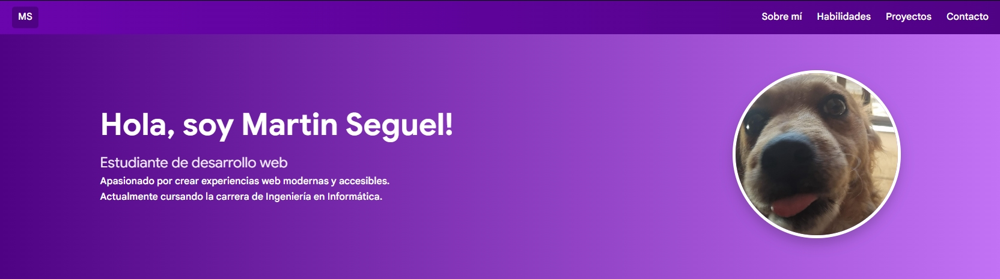
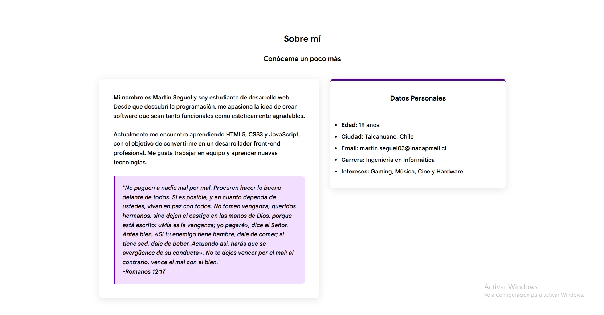
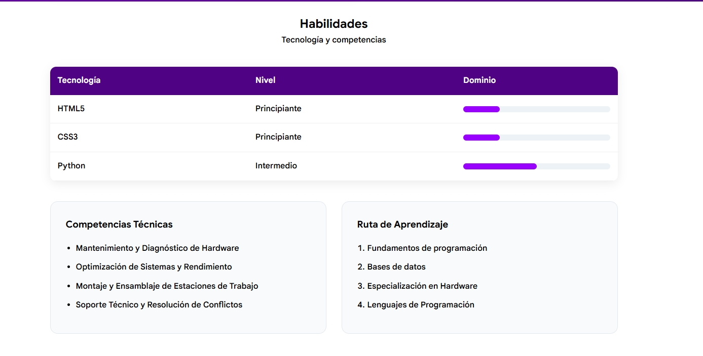
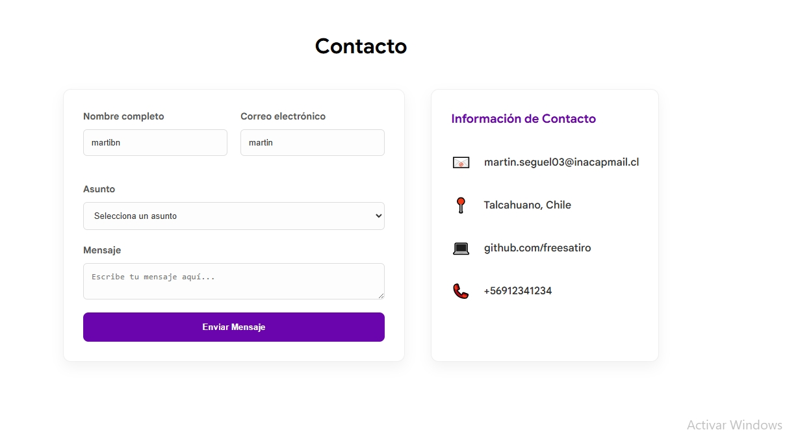
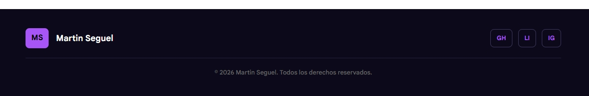

# Portafolio Personal - Martin Seguel

Este repositorio contiene mi portafolio y proyecto web personal desarrollado para la evaluación práctica del módulo de Programación Front-End. 


La estética presente en mi web es enfocada a lo moderno y profesional, centrada en la claridad visual, con una intención de ser elegante y cómoda para el usuario, ideal para mostrar proyectos enfocados a la informática.


## Tecnologías Utilizadas
- **HTML5:** Estructura semántica avanzada utilizando etiquetas de estándar moderno (`<header>`, `<nav>`, `<main>`, `<section>`, `<article>`, `<aside>`, `<footer>`).
- **CSS3:** Diseño personalizado con enfoque en tipografía limpia (Google Sans) y jerarquía visual.
- **Layouts:** Implementación de **Flexbox** para la navegación y **CSS Grid** para la distribución de la galería de proyectos y contacto.
- **Responsive Design:** Adaptabilidad total para dispositivos móviles y escritorio.
- **Git & GitHub:** Gestión de versiones con un historial de commits que refleja el progreso del desarrollo.

## Secciones del Portafolio
1. **Inicio:** Navbar sticky con logo dinámico en imagen.
2. **Sobre mí:** Resumen profesional y biografía personal.
3. **Habilidades:** Listado técnico de competencias en hardware y software.
4. **Proyectos:** Galería de trabajos organizada mediante CSS Grid con tarjetas interactivas (`<article>`).
5. **Contacto:** Formulario con validación nativa e información de contacto directo.

## ¿Cómo ejecutar este proyecto?

Este proyecto es local, por lo que no requiere servidores ni instalaciones complejas.

### Opción 1: Descarga Directa
1. Haz clic en el botón verde **`<> Code`** en la parte superior.
2. Selecciona **`Download ZIP`**.
3. Extrae el contenido y haz doble clic en el archivo **`index.html`** para abrirlo en tu navegador.

### Opción 2: Clonar mediante Git
```bash
# Clona el repositorio
git clone https://github.com/freesatiro/certamen16-04.git

# Entra a la carpeta
cd certamen16-04

Luego, abrir el archivo "index.html" en su navegador preferido para visualizar el proyecto.
```

### Capturas de pantalla

A continuación, les presentaré el diseño final del proyecto web, destacando la vibra minimalista del blanco y el morado, junto a las variaciones de este último y la estructura del contenido en la web.

### 1. Inicio y Breve presentación

*Barra de navegación fija y presentación personal.*

### 2. Sobre mi

*Tabla estilizada con indicadores de progreso visuales.*

### 3. Competencias y Ruta de Aprendizaje

*Uso de listas y tarjetas para organizar la información técnica.*

### 4. Galería de Proyectos

*Distribución de los trabajos realizados utilizando CSS Grid.*

### 5. Contacto

*Formulario con validación e información de contacto lateral.*

### 6. Footer

*Footer final con enlaces a redes sociales y derechos de autor.*


## Autor
**Martin Tomas Seguel**
Estudiante de Ingeniería en Informática | INACAP Concepción-Talcahuano.